# Lab Report: LAB 1/ CONTINUOUS INTEGRATION/DELIVERY WITH JENKINS

## 1.1 Set up the lab environment

```git config --global --list # nakijken config git


ssh-keygen -t rsa -b 4096 -C "lisa.dhooghe@student.hogent.be" #key genereren
eval "$(ssh-agent -s)" #start ssh agent
ssh-add ~/.ssh/id_rsa # ssh key toevoegen


ssh -T git@github.com # test connectie

 git clone git@github.com:HoGentTIN/infra-24-25-lisadhooghe1.git # ophalen startercode
 mkdir cicd-sample-app-new # aanmaken nieuwe dir


cp cicd-sample-app cicd-sample-app-new
cd
cd cicd-sample-app-new
git init
git add.
git commit -m" tekst die commit beschrijft"


git remote add origin git@github.com:lisadhooghe1/cicd-sample-app.git
git push -u origin main


   

```
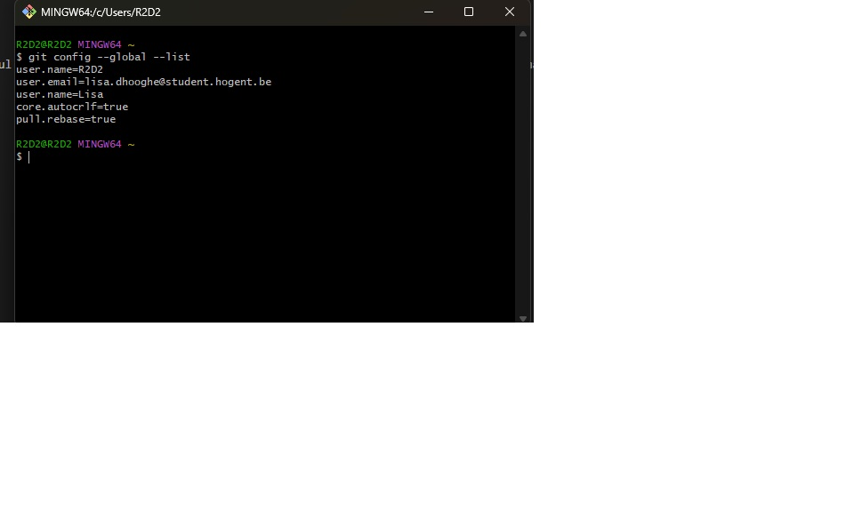
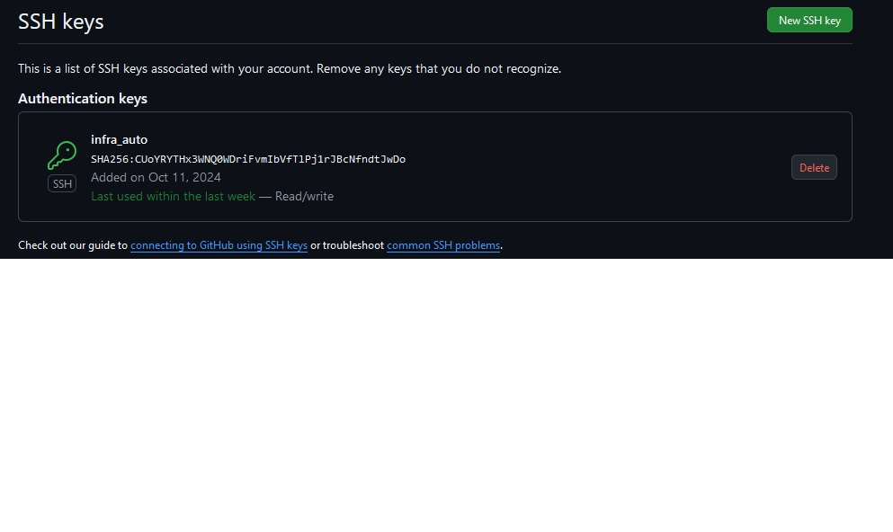 # deze kan je bij SSH toevoegen op account github
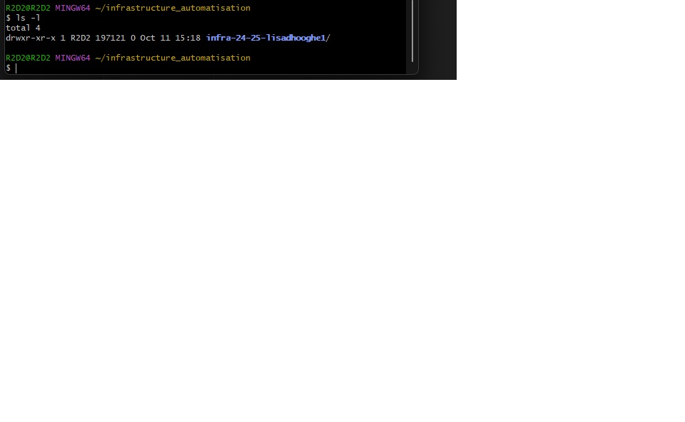
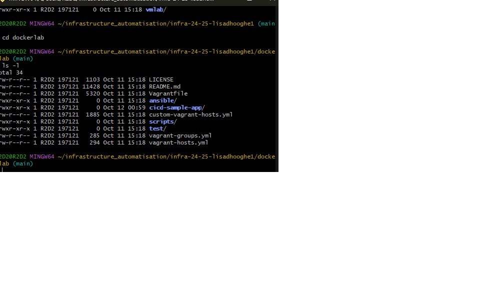# navigeer naar de juiste dir 
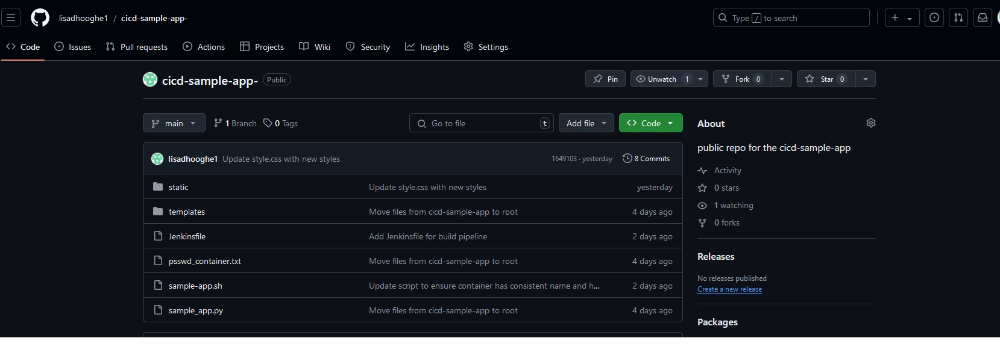#nieuwe repo 

## 1.2  Build and verify the sample application

```vagrant up
vagrant ssh
./sample-app.sh # uitvoeren script , het niet nodig om extra rechten toe te kennen, reeds uitvoerbaar
sudo docker ps -a # list all containers
sudo docker stop <containerID>
sudo docker rm <containerID>

```
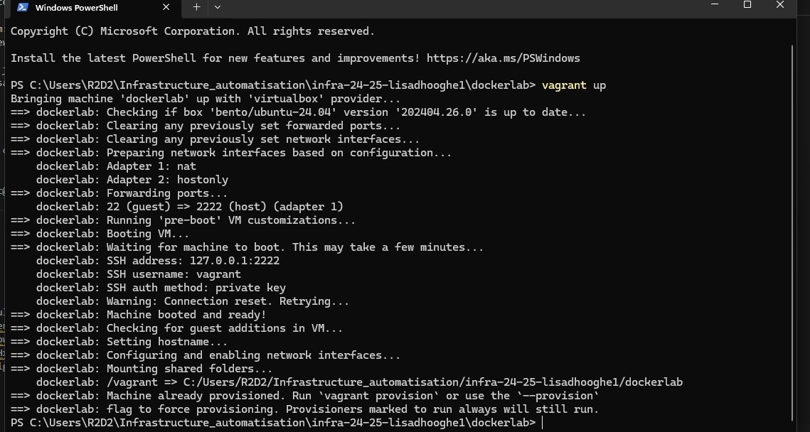 
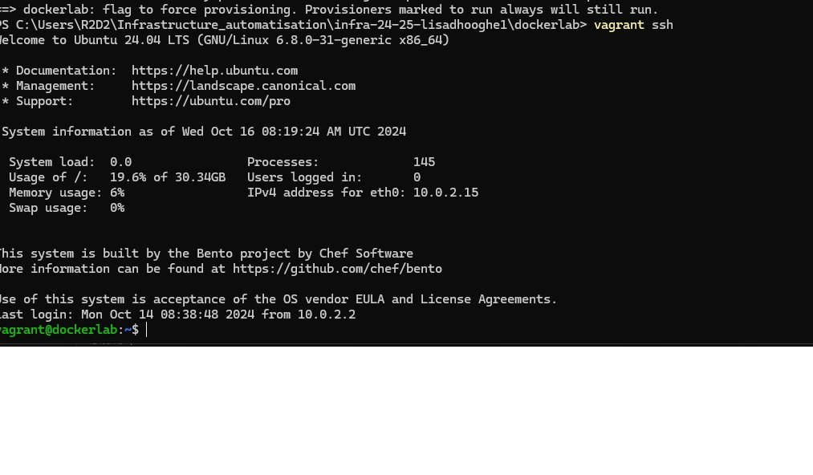 
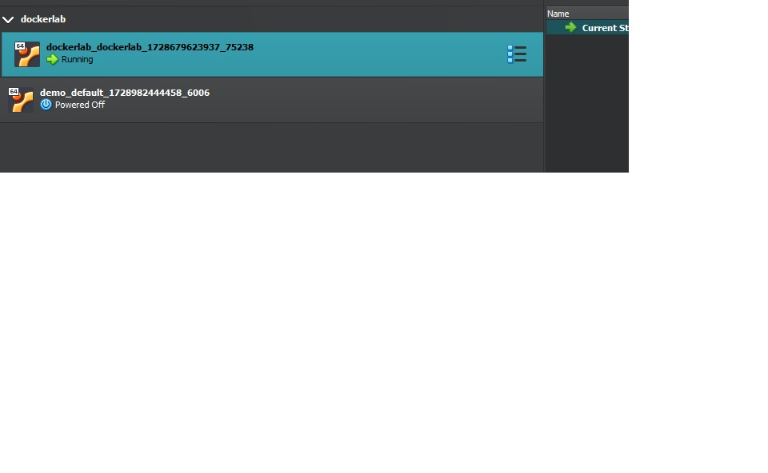 
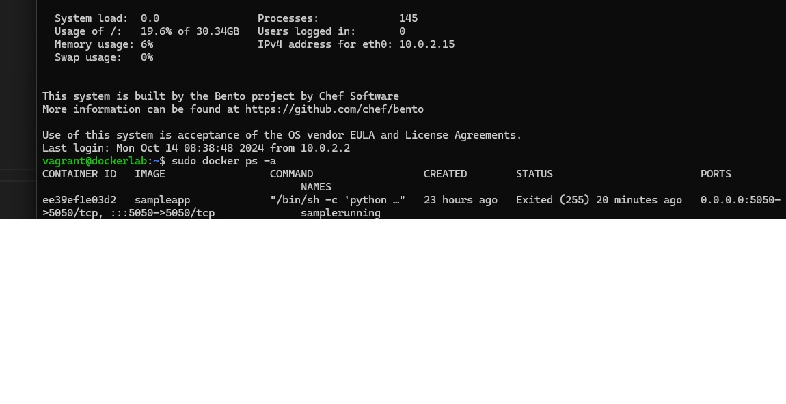 
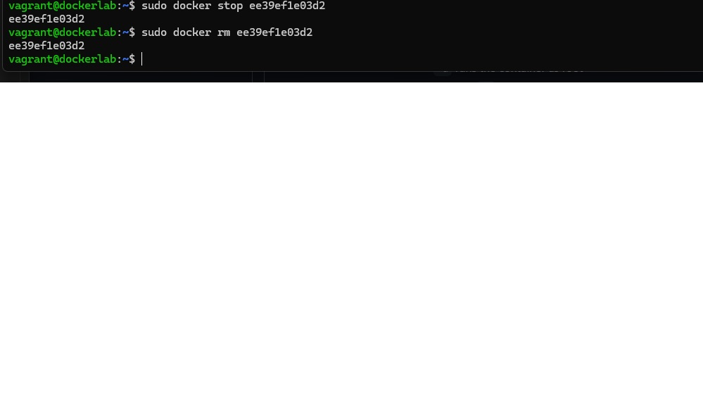 

## 1.3 Download and run the Jenkins docker image

```docker pull jenkins/jenkins:lts
docker run -p 8080:8080 -u root \
  -v jenkins-data:/var/jenkins_home \
  -v $(which docker):/usr/bin/docker \
  -v /var/run/docker.sock:/var/run/docker.sock \
  -v "$HOME":/home \
  --name jenkins_server jenkins/jenkins:lts
  touch passwd_container.txt   # password hier in  opgeslagen en gepushed 
  
  ```
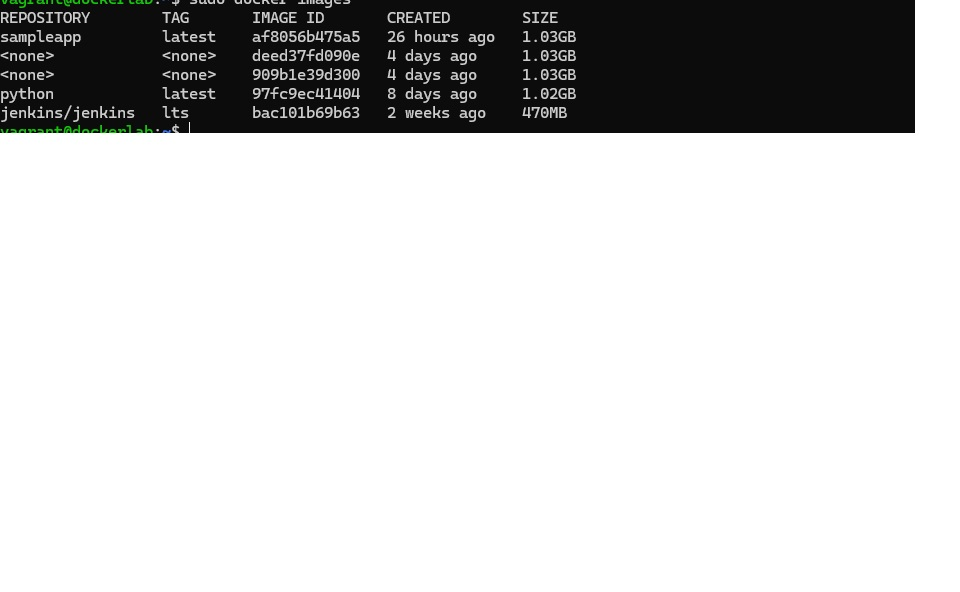 
## 1.4 Configure Jenkins
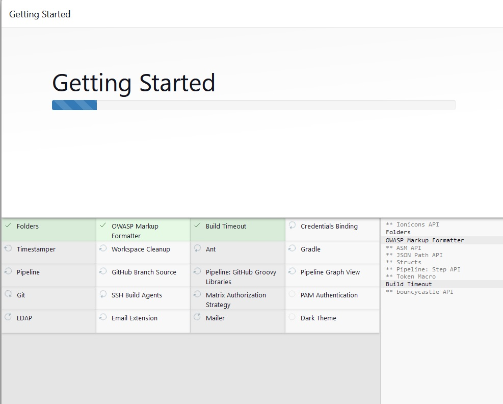 
## 1.5 Use Jenkins to build your application
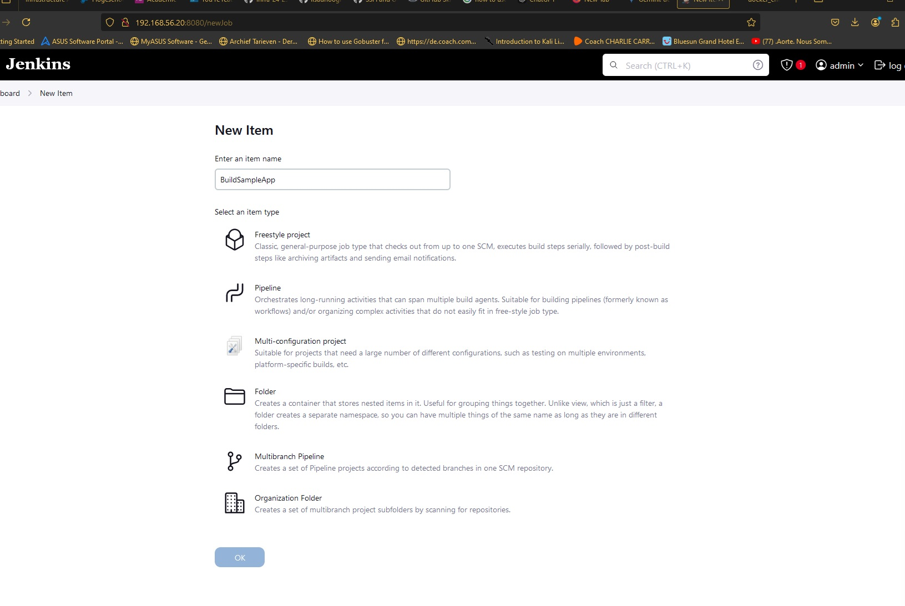 
## 1.6 Add a job to test the application
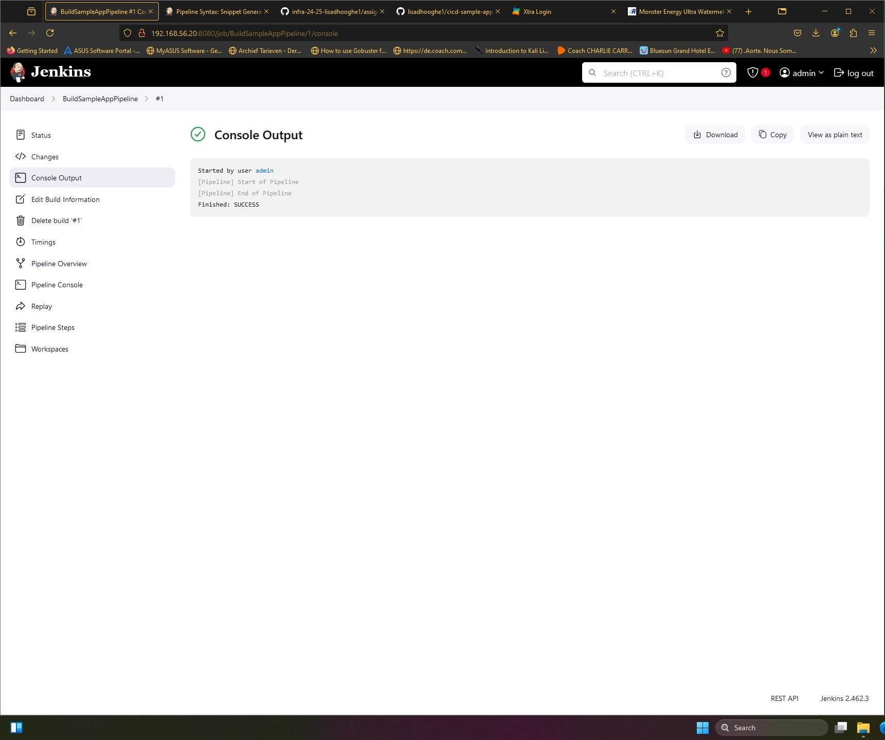 
## 1.7 Create a build pipeline
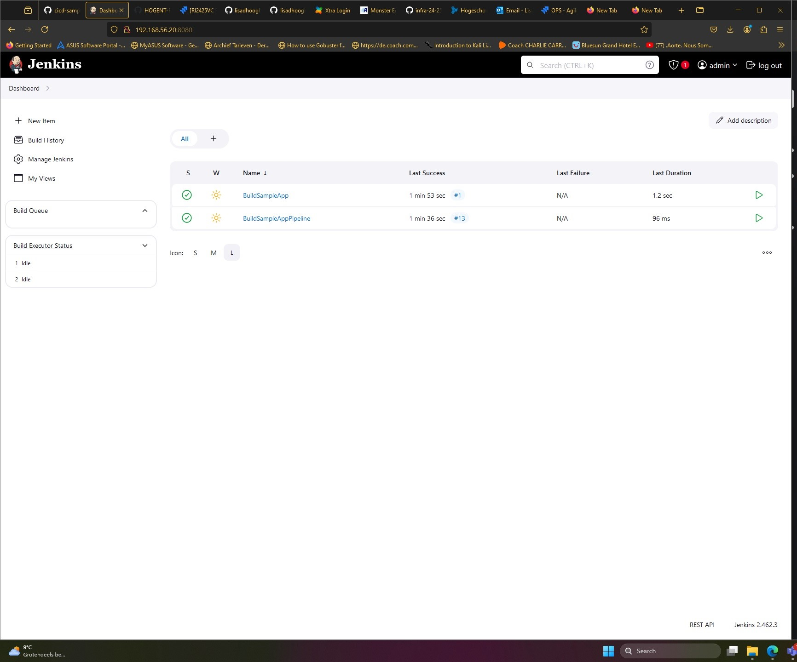 
## 1.7 Use a Jenkinsfile
 ```
pipeline {
    agent any
    stages {
        stage('Cleanup') {
            steps {
                script {
                    sh 'docker stop samplerunning || true'
                    sh 'docker rm samplerunning || true'
                }
            }
        }
        stage('Build') {
            steps {
                sh 'bash ./sample-app.sh'
            }
        }
        stage('Verify') {
            steps {
                script {
                    // Retrieve the IP address of the app container dynamically
                    def appIp = sh(script: "docker inspect -f '{{range .NetworkSettings.Networks}}{{.IPAddress}}{{end}}' samplerunning", returnStdout: true).trim()
                    def jenkinsIp = sh(script: "hostname -i", returnStdout: true).trim()
                    
                    // Verify if the app responds correctly
                    sh "curl http://${appIp}:5050/ | grep 'You are calling me from ${jenkinsIp}'"
                }
            }
        }
    }
}
 ```

## 1.9 Make a change in the application
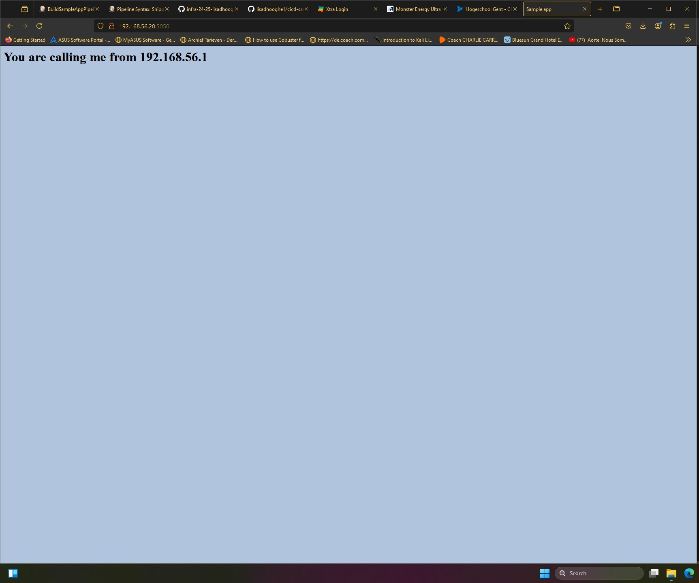 
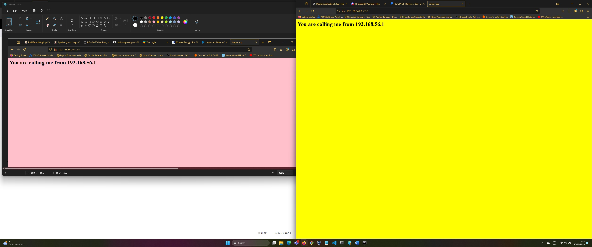 

## Resources

List all sources of useful information that you encountered while completing this assignment: books, manuals, HOWTO's, blog posts, etc.
<https://docs.github.com/en>  = documentatie van github
<https://dev.to/msfaizi/how-to-write-jenkinsfile-a-comprehensive-guide-for-beginners-58d2> = walktrough voor het schrijven van een jenkinsfile

